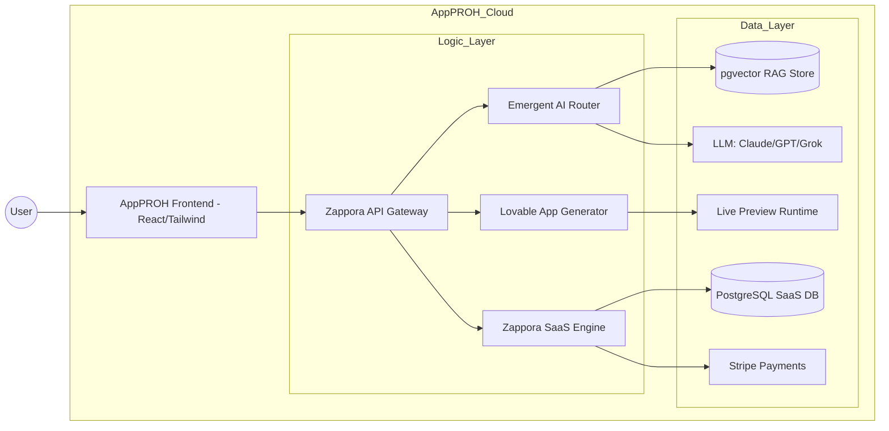
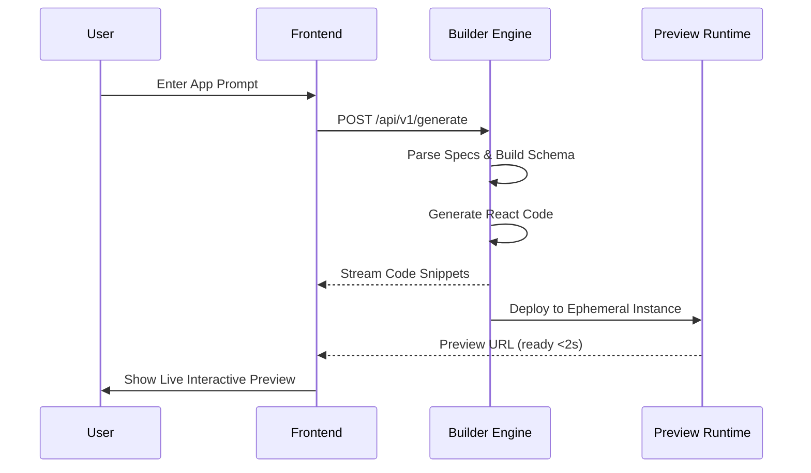
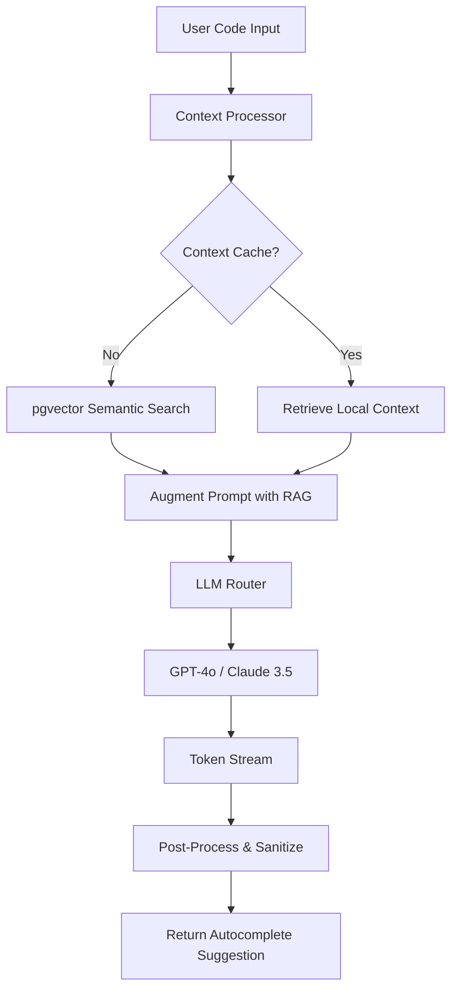
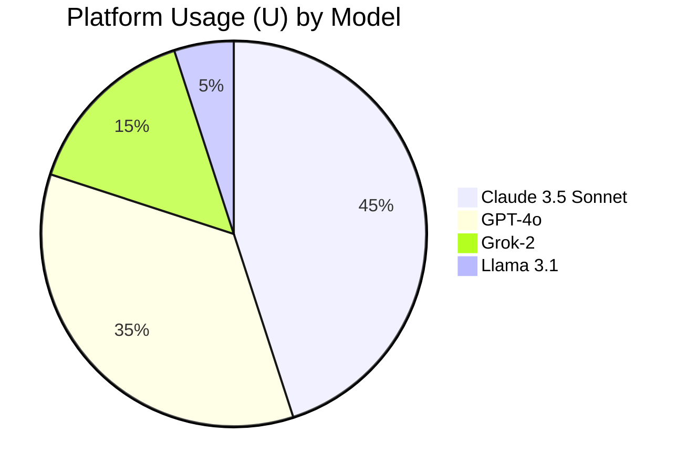

# AppPROH Architecture Diagrams

## 1. Overall System Architecture

```mermaid
graph LR
    User((User)) --> Web[AppPROH Frontend - React/Tailwind]
    
    subgraph AppPROH_Cloud
        Web --> API[Zappora API Gateway]
        
        subgraph Logic_Layer
            API --> Builder[Lovable App Generator]
            API --> Router[Emergent AI Router]
            API --> SaaS[Zappora SaaS Engine]
        end
        
        subgraph Data_Layer
            Router --> RAG[(pgvector RAG Store)]
            Router --> LLM[LLM: Claude/GPT/Grok]
            Builder --> Preview[Live Preview Runtime]
            SaaS --> DB[(PostgreSQL SaaS DB)]
            SaaS --> Stripe[Stripe Payments]
        end
    end
```

## 2. Lovable-style App Creation Flow

```mermaid
sequenceDiagram
    participant U as User
    participant F as Frontend
    participant B as Builder Engine
    participant P as Preview Runtime
    
    U->>F: Enter App Prompt
    F->>B: POST /api/v1/generate
    B->>B: Parse Specs & Build Schema
    B->>B: Generate React Code
    B-->>F: Stream Code Snippets
    B->>P: Deploy to Ephemeral Instance
    P-->>F: Preview URL (ready <2s)
    F->>U: Show Live Interactive Preview
```

## 3. Emergent-style Completion Pipeline

```mermaid
flowchart TD
    A[User Code Input] --> B[Context Processor]
    B --> C{Context Cache?}
    C -- Yes --> D[Retrieve Local Context]
    C -- No --> E[pgvector Semantic Search]
    E --> F[Augment Prompt with RAG]
    D --> F
    F --> G[LLM Router]
    G --> H[GPT-4o / Claude 3.5]
    H --> I[Token Stream]
    I --> J[Post-Process & Sanitize]
    J --> K[Return Autocomplete Suggestion]
```

## 4. ILU Metrics Framework (Zappora)

```mermaid
pie title Platform Usage (U) by Model
    "Claude 3.5 Sonnet" : 45
    "GPT-4o" : 35
    "Grok-2" : 15
    "Llama 3.1" : 5
```
